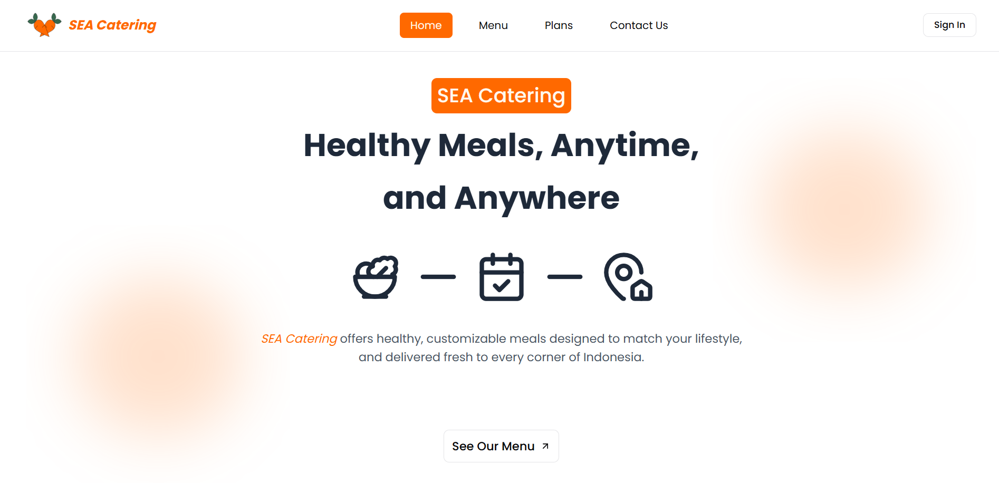

# SEA Catering 🥕

This is the official frontend repository for the **SEA Catering** web application. Built with Next.js, this platform provides a modern, responsive, and intuitive user interface for customers to browse meal plans, manage subscriptions, and interact with the service.

[](https://nextjs.org/)
[](https://tailwindcss.com/)
[](https://ui.shadcn.com/)

**Live Demo:** [sea-catering-silk.vercel.app](sea-catering-silk.vercel.app)



---

## Table of Contents

- [About The Project](#about-the-project)
- [Features](#features)
- [Tech Stack](#tech-stack)
- [Getting Started](#getting-started)
  - [Prerequisites](#prerequisites)
  - [Installation](#installation)
- [Project Structure](#project-structure)
- [Contact](#contact)

## About The Project

SEA Catering is a digital platform designed to help a growing meal delivery business automate its ordering process. This frontend application provides a user-friendly experience for customers, from exploring meal options to managing their own subscriptions, while also giving administrators powerful tools to monitor business performance.

The application is fully decoupled from the backend, communicating via a REST API to handle data and business logic.

## Features

### For All Visitors

- **Homepage:** A welcoming landing page introducing the SEA Catering service, key features, and contact information.
- **Responsive Design:** A seamless user interface that works on both desktop and mobile devices.
- **Menu Display:** A dedicated page to showcase all available menu using interactive cards and modals for detailed information.
- **Customer Testimonials:** A dynamic carousel/slider displays customer reviews, with a form for users to submit their own feedback.

### For Customers

- **Secure Authentication:** User registration and login functionality handled via secure API endpoints.
- **Customized Subscription Form:** An intuitive form for users to subscribe to meal plans, select meal types (Breakfast, Lunch, Dinner), and choose delivery days.
- **Dynamic Price Calculation:** The total subscription cost is calculated and displayed in real-time based on selections.
- **Personalized Customer Dashboard:** A private dashboard where users can:
  - View details of their active subscriptions.
  - Temporarily pause their subscription for a specified date range.
  - Permanently cancel their subscription.

### For Administrators

- **Admin Dashboard:** A protected, role-based dashboard for business monitoring.
- **Subscriptions Report:** Admins can view key metrics with a date-range filter, including:
  - Total Number of New Subscriptions
  - Monthly Recurring Revenue (MRR)
  - Overall Subscription Growth

## Tech Stack

- **Framework:** [Next.js v15](https://nextjs.org/)
- **Styling:** [Tailwind CSS](https://tailwindcss.com/)
- **UI Components:** [Shadcn/UI](https://ui.shadcn.com/)
- **Data Fetching:** [Axios](https://axios-http.com/) (for consuming the REST API)
- **Form Management:** [React Hook Form](https://react-hook-form.com/)
- **Validation:** [Zod](https://zod.dev/)
- **State Management:** [Zustand](https://zustand-demo.pmnd.rs/)
- **Deployment:** [Vercel](https://vercel.com/)

## Getting Started

Follow these instructions to get the frontend running on your local machine for development.

### Prerequisites

- [Node.js](https://nodejs.org/en/) (v18.x or later)
- [npm](https://www.npmjs.com/get-npm)
- **A running instance of the backend server.** This frontend application cannot function without its corresponding backend API.
  - You can find the backend repository here: **[SEA Catering Backend](https://github.com/jevvonn/sea-catering-be)**

### Installation

1.  **Clone the repository:**

    ```bash
    git clone https://github.com/jevvonn/sea-catering-fe.git
    cd sea-catering-fe
    ```

2.  **Install dependencies:**
    ```bash
    npm install
    ```
3.  **Set up environment variables:**
    This application requires the URL of the backend API. Create a `.env.local` file
    in the root of the project by copying the example:

    ```bash
    cp .env.example .env.local
    ```

    Now, open `.env.local` and add the URL of your running backend server:

    ```env
    # The base URL for the backend REST API
    NEXT_PUBLIC_API_URL="http://localhost:3001/api"
    ```

    _Note: The `NEXT_PUBLIC_` prefix is required to expose the variable to the browser._

4.  **Run the development server:**

    ```bash
    npm run dev
    ```

    Open [http://localhost:3000](http://localhost:3000) in your browser to see the application.

    ### OR

5.  **Build the Next.js project**

    ```bash
     npm run build
    ```

6.  **Run the frontend project**

    ```bash
     npm start
    ```

_To access admin features, you must log in with an account that has an `ADMIN` role. Admin accounts should be created via the backend service._

## Project Structure

The project uses the Next.js App Router for a feature-colocated structure.

```
/
├── app/                  # Application routes and UI
│   ├── (auth)/           # Authentication routes
│   │   ├── sign-in/        # Sign in page
│   │   ├── sign-up/        # Sign up page
│   ├── (main)/           # Main app layout and pages
│   │   ├── plans/          # Meal plans
│   │   ├── menus/          # Admin dashboard
│   │   └── ...             # Other main routes
|   ├── (dashboard)/
│   │   └── ...           # Other dashboard pages
│   └── layout.tsx        # Root layout
├── components/           # Reusable React components
│   └── ui/               # Shadcn UI primitives
├── lib/                  # Utility functions, helpers
├── services/             # API call definitions (e.g., auth service, subscription service)
├── public/               # Static assets (images, fonts)
└── ...
```

## Contact

Jevon Mozart - [@j_vmcb](https://instagram.com/j_vmcb) - [jmcb1602@gmail.com](mailto:jmcb1602@gmail.com)

Project Link: [https://github.com/jevvonn/sea-catering-fe](https://github.com/jevvonn/sea-catering-fe)
